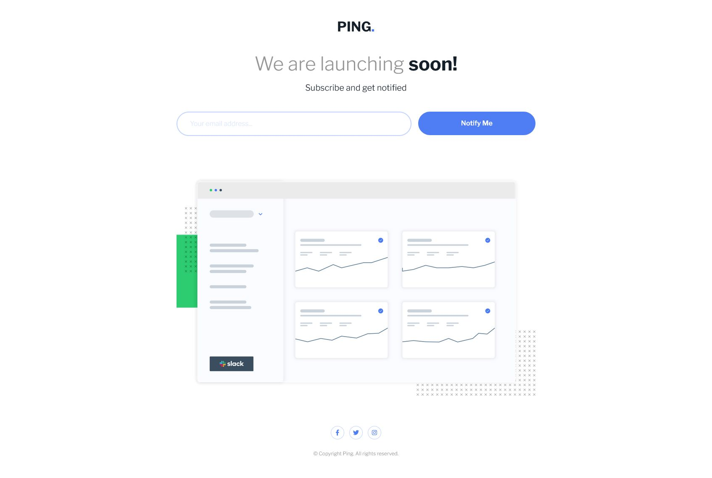

# Frontend Mentor - Ping coming soon page solution

This is a solution to the [Ping coming soon page challenge on Frontend Mentor](https://www.frontendmentor.io/challenges/ping-single-column-coming-soon-page-5cadd051fec04111f7b848da). Frontend Mentor challenges help you improve your coding skills by building realistic projects.

## Table of contents

- [Overview](#overview)
  - [Screenshot](#screenshot)
  - [Links](#links)
- [My process](#my-process)
  - [Built with](#built-with)
  - [What I learned](#what-i-learned)
- [Author](#author)

## Overview

Hi! This is my attempt at the Ping Coming Soon page. This is my first Frontend Mentor project involving the use of Javascript.

For this challenge, I decided to keep it simple with the form validation: check for an empty string, and use a regex pattern for the email format, and output the corresponding error upon the form submit. Initially I considered real-time validation upon keyup, but went with the form submit validation instead.

### Screenshot

Desktop

Mobile

### Links

- Solution URL: [Here!](https://github.com/sheronimo/frontendmentor-pingcomingsoon)
- Live Site URL: [Here!](https://sheronimo.github.io/frontendmentor-pingcomingsoon/)

## My process

1. I restructured all of the markup before moving on to styling.
2. I modularised my SASS files for better structuring and readability, then worked on them in order (declaring variables based on the style guide, resets, the page and its elements, then media queries).
3. After fine-tuning the styling to match the design document as much as possible (including responsive styling), I then worked on the Javascript form validation.

### Built with

- Semantic HTML5 markup
- SASS
- Flexbox
- Grid
- Javascript form validation (Event listeners)

### What I learned

I learned mainly about regular expressions, to validate the correct email string format.

## Author

- Github - [sheronimo](https://github.com/sheronimo)
- Frontend Mentor - [@sheronimo](https://www.frontendmentor.io/profile/sheronimo)
